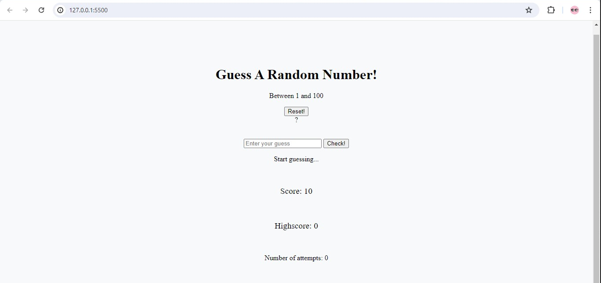
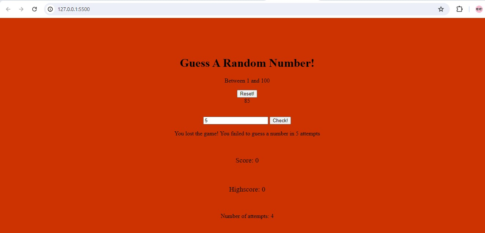
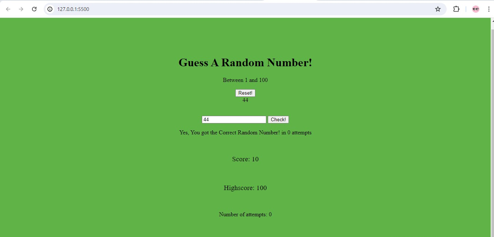

# Javascript Guess Number Game
This game is designed to engage the user to guess a random number between 1 and 100. The user can make a maximum of 5 attempts. 


Getting Started
1. To get started, clone the repository to your local machine:
```bash
git clone https://github.com/RaphAlemoh/js-guess-game.git
```

2. Navigate to the project directory:
```bash
cd js-guess-game
```

Launch the the `index.html` file in any web browser to play the guess game.

## How to Play
2. The app will generate a random number between 1 and 100.
3. Guess the number by entering a value between 1 and 100 in the input field and clicking the "Check" button.
4. If your guess is too low, the message "Too low!" will be displayed. If your guess is too high, the message "Too high!" will be displayed.
5. There's a total of 5 attempts to guess the correct number.
6. If you guess the number correctly within 5 attempts, the message "Yes, You got the Correct Random Number! in X attempts" will be displayed, where X is the number of attempts you took.
7. If you run out of attempts without guessing the number correctly, the message "You lost the game!. You failed to guess a number in 5 attempts. The secret number generated randomly by the app will be displayed.

# Demo 

- Landing Page presented to the user


- Exhausted 5 trials



- Correct Guess



## Contributing
If you would like to contribute to this project, please fork the repository and submit a pull request with your changes.

## License
This project is licensed under the MIT License - see the [LICENSE](https://opensource.org/license/mit/) file for details.